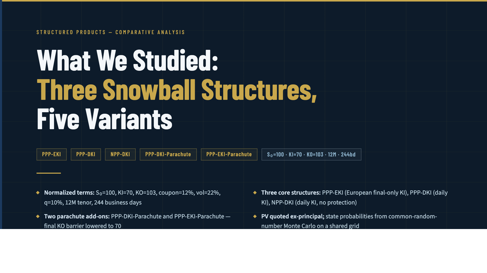
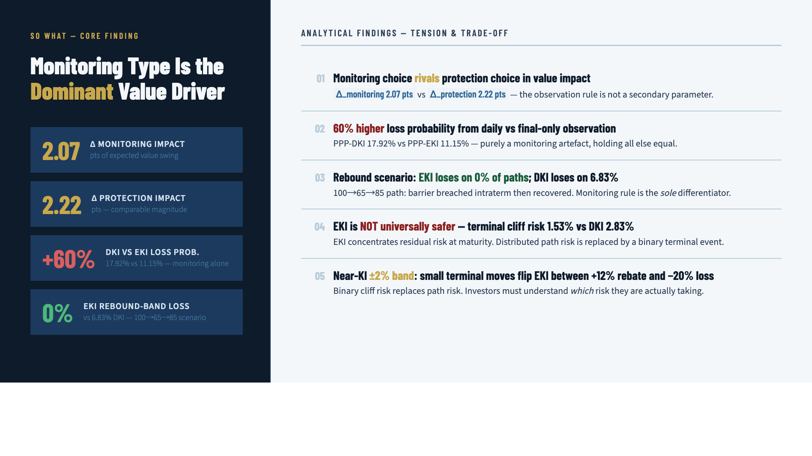
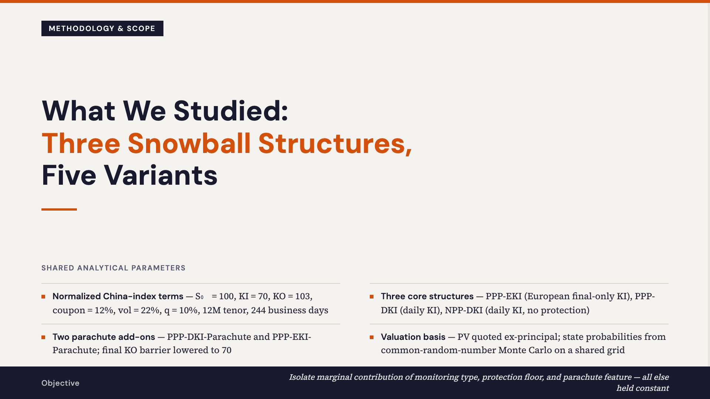
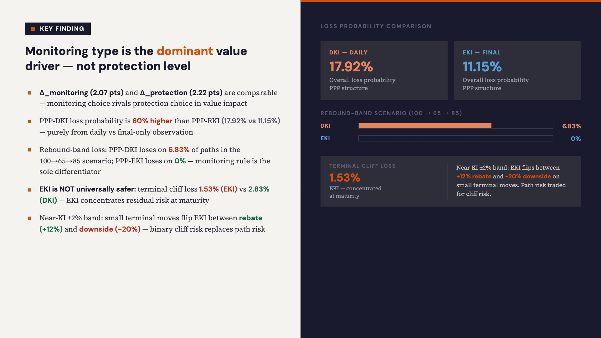
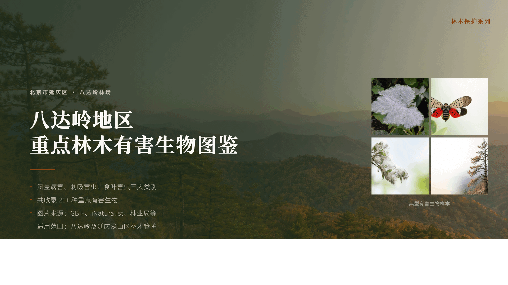
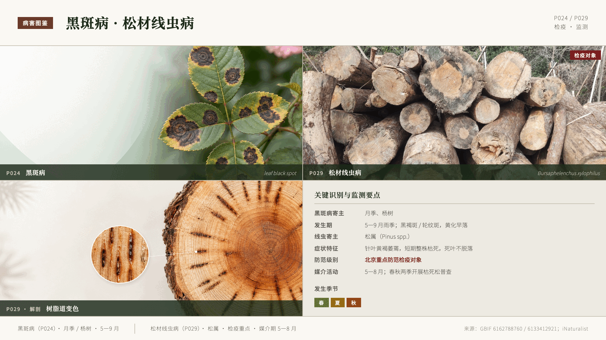

# Open Slides Zero

Open Slides Zero is an end-to-end slide-deck agent. It turns source materials
into an outline, visual direction, layout plan, and HTML slide deck, with human
review gates and a comment-driven edit loop.

The backend uses FastAPI, LangGraph, and the OpenAI SDK pointed at ZenMux for
model routing. The frontend is a Vite + React app.

Free hosted app: [www.artena.one](https://www.artena.one). Bring your own
ZenMux API key; the hosted app keeps that key in your browser session and sends
it only to the same-origin backend for active generation requests.

## Examples

Open Slides Zero can produce dense analytical decks, product-explanation decks,
and image-led reference decks from plain source material.

### Snowball — Strategic Prestige

Full PNG export: [docs/images/snowball-strategic-prestige](docs/images/snowball-strategic-prestige)





### Snowball — Product Clarity

Full PNG export: [docs/images/snowball-product-clarity](docs/images/snowball-product-clarity)





### Bugs 2 (fork)

Full PNG export: [docs/images/bugs-2-fork](docs/images/bugs-2-fork)





## Architecture

```text
Frontend (Vite + React, :5174)
    | fetch -> /api/* (proxied)
    v
FastAPI (:8765) -> app/api/{decks,hitl,comments,history,images,playground,shares}
    |
    v
LangGraph StateGraph
    ingest -> propose_structure -> [review: structure]
           -> outline -> [review: outline]
           -> style -> [review: style]
           -> layout -> [review: layout]
           -> consolidate -> Send(html_one, i) x N -> ready
           -> [optional image insertion: plan/apply/generate]
           <-> edit_intent on comments
    |
    v
SqliteSaver checkpointer (authoritative state)
    |
    v
./threads/{thread_id}/*.md and slides/*.html (derived mirror)
```

LangGraph owns the state machine, checkpointing, review interrupts, and
parallel `Send` fan-out. LLM calls are direct OpenAI SDK calls against the
ZenMux OpenAI-compatible gateway, so per-node model routing stays explicit in
`backend/app/llm/models.py`.

## Quickstart

### Backend

Requires Python 3.11.

```bash
cd backend
python -m venv .venv
source .venv/bin/activate
pip install -e ".[dev]"
cp .env.example .env
# Optional for local development: set ZENMUX_API_KEY as a server-side fallback.
set -a && source .env && set +a
uvicorn app.main:app --host 127.0.0.1 --port 8765 --reload
```

### Frontend

Requires Node.js 20 or newer.

```bash
cd frontend
npm install
npm run dev
```

The frontend dev server binds to `http://localhost:5174` and proxies `/api/*`
to `http://localhost:8765`.

## Secrets

Do not commit real secrets. The public app expects each user to enter their own
ZenMux key in the frontend Config panel. That runtime key is held in
`sessionStorage`, sent through request headers, and not written to server
checkpoints, mirrored thread files, or server environment files.

For local development, you may copy `backend/.env.example` to `backend/.env`
and set `ZENMUX_API_KEY` as a fallback so backend-only commands work without the
frontend Config panel. Keep real API keys in ignored files only. The repository
tracks only placeholder environment examples.

## Public App Privacy

The hosted app uses anonymous deck ownership. On first use, the backend issues a
persistent random owner token in an HttpOnly cookie and stores only its SHA-256
hash. Decks, playground lanes, comments, image assets, history, and thread
exports are readable only from the browser profile that created them. Clearing
browser cookies loses access to anonymous decks.

The browser also keeps a current-session deck list in `sessionStorage`. That
list is only a convenience view for the active tab/session and is cleared when
the browser session ends. The persistent "My history" deck list comes from the
owner cookie above; users can access it again from the same browser profile as
long as that cookie remains.

Deck sharing is explicit and read-only by default. A share link exposes only the
public deck snapshot needed to preview slides, such as the deck title, stage,
aspect ratio, and rendered HTML slides. Runtime ZenMux keys are never included
in share responses or forked state. Viewers who want to edit a shared deck must
fork it into their own owner namespace and provide their own ZenMux key in the
Config panel for any new generation or edit requests.

Before publishing or opening a PR, verify that only the example env file is
tracked:

```bash
git ls-files | rg '(^|/)\.env($|\.)|\.env'
git check-ignore -v .env backend/.env frontend/.env backend/.env.local frontend/.env.local
```

## Verification

Backend tests:

```bash
cd backend
.venv/bin/pytest
```

Frontend build:

```bash
cd frontend
npm run build
```

Graph import sanity check:

```bash
backend/.venv/bin/python -c "import os; os.environ['ZENMUX_API_KEY']='probe'; from app.graph.graph import get_graph; print('nodes:', list(get_graph().nodes.keys()))"
```

## Usage

1. Paste source material or upload supported files.
2. Pick page count, aspect ratio, density, language, and optional visual style.
3. Review the proposed scenario and narrative structure.
4. Review or revise the generated outline.
5. Review visual style, then layout choices.
6. Render the deck slide by slide.
7. Optionally insert images into placeholder slots: match uploaded/linked image
   assets, apply mappings, or generate missing slot images.
8. Draw a box on any slide and leave a comment to trigger targeted edits.
9. Share a ready deck with a read-only link, or open a shared deck and fork it
   into your own history before editing.

Creator Playground can branch from a shared outline into multiple lane threads,
each with its own creator prompt, style/layout/html checkpoints, cutoff status,
and slide-by-slide arena comparison.

Decks can be exported as a single HTML file, an HTML zip, a PNG zip, or an
editable PPTX. PNG export rasterizes each slide to `slide_XX.png` and packages
the images with a small index page. PPTX export walks each slide DOM in the
browser. Remote HTTP(S) images are fetched through the backend `/images/proxy`
endpoint so public image URLs can be embedded or rasterized same-origin; if a
remote image cannot be loaded, export keeps going and uses an "Image
unavailable" placeholder in that image slot.

History has two browser-facing scopes:

- Current session decks are tracked in `sessionStorage` so the UI can show only
  decks created or opened in the active browser session.
- My history decks are loaded from the backend owner token and can include decks
  from earlier sessions in the same browser profile.

Sharing uses these endpoints:

- `POST /decks/{thread_id}/share` creates or returns an opaque share link for a
  deck owned by the current browser profile.
- `GET /shares/{share_id}` returns the read-only public snapshot for preview.
- `POST /shares/{share_id}/fork` copies the shared deck into the viewer's own
  owner namespace so they can edit with their own ZenMux key.

Image insertion is an optional ready-time stage. During ingest, uploaded image
files and image URLs become `image_assets`. During HTML rendering, empty visual
slots remain explicit `data-image-placeholder="true"` elements. Once all slides
are rendered, `post_html` sets `image_insertion_status` to `available` when
there are assets or placeholders; the ready screen can then call:

- `POST /decks/{thread_id}/images/plan` to match assets to slots.
- `POST /decks/{thread_id}/images/apply` to replace selected placeholders with
  `` tags.
- `POST /decks/{thread_id}/images/generate` or `generate_batch` to create new
  images for unmatched slots.

The first applied image pass preserves the original placeholder HTML in
`html_slides_base`, so image mappings can be changed without compounding edits
against already-inserted `` tags.

## Model Routing

Default subagent models live in `backend/app/llm/models.py`. In the browser,
the Config panel can override all ZenMux-backed stages for the current session.
For local backend-only runs, override any node with environment variables:

```bash
OSZ_MODEL_OUTLINE=anthropic/claude-sonnet-4.6
OSZ_MODEL_STYLE_VISION=google/gemini-3.1-pro-preview
OSZ_MODEL_HTML=anthropic/claude-sonnet-4.6
```

If a non-vision-capable model is routed to a node with images, the adapter
reroutes to the configured vision fallback.

## Repository Map

```text
backend/
  app/
    main.py                 FastAPI entrypoint
    api/                    HTTP endpoints, SSE streaming, image insertion
                            and share/fork flows
    graph/                  LangGraph state, wiring, and nodes
    llm/                    ZenMux adapter, streaming, model routing, vision
    catalog/                Structure, scenario, layout, scorer, validator
    artifacts/              Derived markdown/html mirror writer
  tests/                    Backend behavior and regression tests

frontend/
  src/
    App.tsx                 Workflow shell
    DeckCanvas.tsx          Iframe-per-slide canvas
    CommentLayer.tsx        Drag-box comment overlay
    HitlReviewPanel.tsx     Review gates
    PlaygroundPanel.tsx     Creator Playground
    api.ts                  Fetch wrapper
```

## Design Rules

- The LangGraph checkpointer is authoritative; files under `threads/` are a
  derived mirror and should not be read back into state.
- `html_slides` is a `dict[int, str]` merged by a reducer so fan-out writes do
  not clobber each other.
- Regenerate-from-stage rewinds to the checkpoint whose `next` queue contains
  the target node; it does not fake-inject node output.
- Comments collapse to the earliest affected stage so downstream state is
  regenerated consistently.
- Layout selection is deterministic: the LLM proposes candidate patterns, then
  Python scorer logic ranks them.
- Anti-slop HTML rules are enforced both in the slide prompt and in the
  catalog validator.
- Image insertion is a ready-time, API-driven stage. Preserve
  `html_slides_base` when replacing placeholders so mappings can be changed
  idempotently.
- PNG and PPTX export must be best-effort around image loading. External image
  fetch failures should not abort the whole deck export.
- Share responses and forked checkpoints must never expose runtime API keys,
  owner tokens, request headers, or local secret material. Shared decks are
  previews; editing always happens after a fork under the viewer's owner token.

## License

Open Slides Zero is open source under the MIT License. See [LICENSE](LICENSE).
